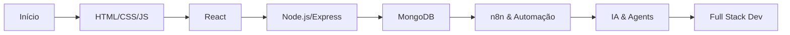

# 👋 Olá, eu sou o Rafael Silva Xavier!

  
  
  
  
  
  
  
  
  

###

  
  
  

---

## 🚀 Sobre Mim

🎯 **Desenvolvedor Full Stack em formação** na DevClub, focado em criar soluções tecnológicas inovadoras.

💡 **Apaixonado por transformar ideias em realidade** através do código, com especial interesse em automação, IA e desenvolvimento web moderno.

🌱 **Em constante evolução**, sempre buscando aprender novas tecnologias e melhores práticas de desenvolvimento.

---

## 🛠️ Tech Stack

### Front-end Development

  
  
  
  
  
  
  

### Back-end Development

  
  
  

### Database & Tools

  
  
  
  
  

### Automation & AI

  
  
  ⚙️ n8n
  
  🤖 IA Agents

---

## 🌟 Projetos em Destaque

### 🤖 Agente Financeiro & Vendas
**Tecnologias:** n8n, Node.js, IA, WhatsApp API

Desenvolvimento de um assistente de IA inteligente para gerenciamento financeiro e atendimento automatizado via WhatsApp para o projeto Sabor Real.

- 📊 Análise financeira automatizada
- 💬 Atendimento inteligente 24/7
- 🔄 Workflows de automação complexos

### 🎨 Sabor Real
**Tecnologias:** HTML, CSS, JavaScript

Projeto inicial de front-end com design moderno e responsivo.

- 🌐 Interface responsiva
- 🎯 UX/UI otimizada
- 📱 Mobile-first approach

---

## 📊 GitHub Stats

  
  

---

## 🎯 Objetivos

### Curto Prazo
- [ ] Dominar ecossistema React (Hooks, Context API, Redux)
- [ ] Construir APIs RESTful robustas com Node.js
- [ ] Aprofundar conhecimento em MongoDB e modelagem de dados
- [ ] Implementar testes automatizados em projetos

### Médio Prazo
- [ ] Explorar desenvolvimento mobile com React Native
- [ ] Trabalhar com arquitetura de microserviços
- [ ] Integrar soluções de IA/ML em aplicações web
- [ ] Contribuir com projetos open source

---

## 📈 Minha Jornada

---

## 💬 Conecte-se comigo

  
  
  

---

  

  
<strong>"O único limite para nossa realização de amanhã serão nossas dúvidas de hoje."</strong> - Franklin D. Roosevelt

---

**✨ Obrigado por visitar meu perfil! Vamos construir algo incrível juntos! 🚀**
